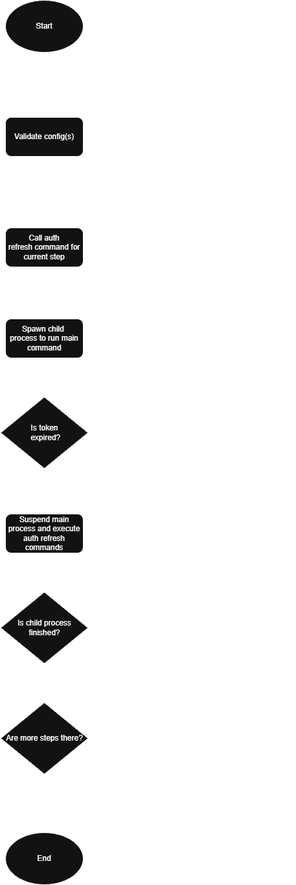

Toki comes with a process module which is an abstraction over `exec` that helps with suspending and resuming processess. You can learn more about process and its architecture here.

## Configuration

Everything in Toki is controlled by a config, from strategies to how long after the child process gets suspended. There are 3 types of config in Toki:

### Pipeline config

A pipeline config is consumed by Toki as its input. Pipeline config contains steps which contains information such as which main command would be executed, after how long the auth tokens expire, etc. A pipeline config has the highest priority, which means at the time of merge conflicts between different types of config, pipeline config would be given priority.

### Project config

Project config contains reusable steps at project level. These steps can be imported in pipeline config using `inherit` strategy and `use` key, you can learn more about project config here.

**NOTE: At the time of writing this doc Toki doesn't support searching for project config, you need to explicitly define its path by using `-p` arg**

### Userspace config

Userspace config contains reusable steps defined in home dir. This means these steps can be inherited by pipeline config irrespective of whatever project they are in, for example you can have a & b project, each with their own project & pipeline config, and a userspace config with `test` step in it which can be then used by pipeline config directly irrespective of whether it is defined in proejct config or not.

## 10000ft overview

When you run a toki pipeline you can think of the following actions happening at high-level:
1. Toki validates the config(s) passed,
2. Toki calls the auth refresh command defined for the current step,
3. Toki spawns a child process to execute the step command,
4. Toki actively polls for auth token expiry,
5. If token is expired as per the config, Toki suspends the child process and starts executing the auth refresh commands

Toki keeps on repeating step 2 - 5 for each step defined in the pipeline config.

Following is the flowchart of the same steps mentioned above

